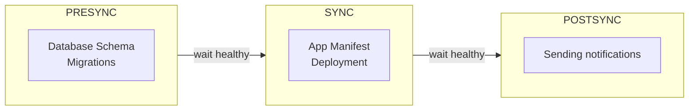

# Sync Phases and Waves

## Phases

## Verwendung

### Resource Hooks

Wird über die Annotation ``argocd.argoproj.io/hook`` definiert.
Die Annotation wird in die gewünschten Manifeste hinzugefügt.

> Sollte ein "Selective Sync" durchgeführt werden, funktionieren Hooks nicht.

| Hook     | Beschreibung                                                                                        |
|----------|-----------------------------------------------------------------------------------------------------|
| PreSync  | Sollte für Synchronisierungen verwendet werden, die vor den Manifesten synchronisiert werden müssen |
| Sync     | Wird nach der PreSync Phase ausgeführt. Hier werden meist die Manifeste synchronisiert              |
| Skip     | ArgoCD überspringt das Manifest                                                                     |
| PostSync | Wird nach der Sync Phase ausgeführt                                                                 |
| SyncFail | Wird im Fehlerfall ausgelöst                                                                        |

Quelle: https://argo-cd.readthedocs.io/en/stable/user-guide/resource_hooks/#usage

### Hook Deletion Policies

Wird über die Annotation ``argocd.argoproj.io/hook-delete-policy`` definiert

| Policy             | Beschreibung                                                                                     |
|--------------------|--------------------------------------------------------------------------------------------------|
| HookSucceeded      | Die für den Hook nötige Ressource wird nach erfolgreicher Beendigung gelöscht                    |
| HookFailed         | Die für den Hook nötige Ressource wird nach Fehlschlag gelöscht                                  |
| BeforeHookCreation | Standardverhalten: Jede existierende Hook Ressource wird gelöscht, bevor eine neue erstellt wird |

Quelle: https://argo-cd.readthedocs.io/en/stable/user-guide/resource_hooks/#hook-deletion-policies

